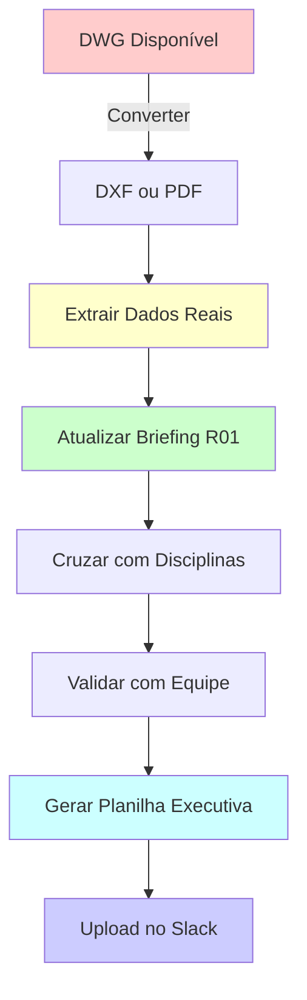

# 📚 Índice - Sistema de Exaustão (Churrasqueiras) | Thozen Electra

---

## 📄 Arquivos Gerados

### 1. Briefing Técnico Completo
**Arquivo:** `exaustao-r00.md` (17 KB)  
**Conteúdo:**
- Escopo e premissas técnicas (NBR 14518)
- Quantitativos detalhados por categoria (equipamentos, dutos, elétrica, controles)
- Especificações técnicas completas
- Tabelas prontas para orçamento executivo
- Identificação de interferências com outras disciplinas
- Lista de dados faltantes (críticos)
- Recomendações para próximas etapas

⚠️ **IMPORTANTE:** Todos os quantitativos são ESTIMADOS (não extraídos do DWG). Marcados com "⚠️ A CONFIRMAR COM DWG".

---

### 2. Resumo Executivo
**Arquivo:** `exaustao-r00-RESUMO.md` (6.3 KB)  
**Conteúdo:**
- Status da extração (limitações do DWG)
- Tabela de quantitativos estimados (principais componentes)
- Lista de dados faltantes (críticos)
- Compatibilizações necessárias com outras disciplinas
- Checklist de validação
- Impacto no orçamento (ordem de grandeza)
- Recomendação de próxima ação

**Ideal para:** Apresentação rápida ao time, decisão de prioridades.

---

### 3. Checklist de Próximas Ações
**Arquivo:** `exaustao-r00-PROXIMAS-ACOES.md` (7.3 KB)  
**Conteúdo:**
- Passo a passo para obter dados reais do DWG (3 opções)
- Lista detalhada de dados críticos a extrair
- Checklist de compatibilizações com outras disciplinas
- Etapas de validação com equipe de projetos
- Roteiro para atualizar briefing e gerar planilha executiva
- Tempo estimado e ferramentas necessárias

**Ideal para:** Execução prática, acompanhamento de tarefas.

---

### 4. Índice (Este Arquivo)
**Arquivo:** `exaustao-r00-INDICE.md` (este arquivo)  
**Conteúdo:**
- Sumário dos arquivos gerados
- Fluxo de trabalho recomendado
- Referências rápidas

---

## 🔄 Fluxo de Trabalho Recomendado

### Etapas:
1. **DWG → DXF/PDF** → Converter arquivo (10-15 min)
2. **Extrair Dados** → Manual ou automatizado (1-2 horas)
3. **Atualizar Briefing** → Substituir estimativas por valores reais (30 min)
4. **Cruzar Disciplinas** → Elétrico, Arquitetura, Estrutura, PCI (1-2 horas)
5. **Validar com Equipe** → Confirmar premissas e especificações (30 min)
6. **Gerar Planilha** → Excel com quantitativos e custos (1-2 horas)
7. **Upload no Slack** → Entregar ao time (5 min)

**Tempo total estimado:** 4-6 horas

---

## 🎯 Referências Rápidas

### Quantitativos Estimados (Principais)
| Item | Estimativa | UN |
|------|-----------|-----|
| Churrasqueiras atendidas | 2-4 | UN |
| Exaustores centrífugos | 1-2 | UN |
| Vazão total do sistema | 8.000-12.000 | m³/h |
| Potência instalada | 5-10 | CV |
| Dutos (total) | 100-150 | m |
| Coifas inox AISI 304 | 2-4 | UN |
| Grelhas de ventilação | 4-8 | UN |

### Disciplinas a Cruzar
- **09 - Elétrico** → Alimentação, cabos, quadros
- **02 - Arquitetura** → Layout, interferências, acabamentos
- **01 - Estrutura** → Passagens, furos, reforços
- **07 - PCI Civil** → Dampers corta-fogo, proteção passiva
- **14 - Ar-condicionado** → Ventilação de compensação

### Normas Aplicáveis
- NBR 14518:2000 - Sistemas de ventilação para cozinhas profissionais
- NBR 16401-1:2008 - Instalações de ar-condicionado
- Código Sanitário Municipal de São Paulo (CSMSP)
- IT 46 - CBPMESP (se aplicável)

---

## 📎 Localização dos Arquivos

### Fontes de Dados
- **DWG original:** `projetos/thozen-electra/projetos/13 CHURRASQUEIRA EXAUSTAO/DWG/RA_CHU_EXE_PROJETO_R00.dwg`
- **Cópia para análise:** `executivo/thozen-electra/fontes/RA_CHU_EXE_PROJETO_R00.dwg`

### Briefings Gerados
- **Briefing completo:** `executivo/thozen-electra/briefings/exaustao-r00.md`
- **Resumo executivo:** `executivo/thozen-electra/briefings/exaustao-r00-RESUMO.md`
- **Próximas ações:** `executivo/thozen-electra/briefings/exaustao-r00-PROXIMAS-ACOES.md`
- **Índice:** `executivo/thozen-electra/briefings/exaustao-r00-INDICE.md`

### Planilha (A Gerar)
- **Futura:** `executivo/thozen-electra/planilhas/exaustao-r01.xlsx` (após extração de dados reais)

---

## ⚠️ Limitação Conhecida

**Problema:** Arquivo DWG binário não conversível sem ferramentas CAD específicas.

**Impacto:** Todos os quantitativos nesta revisão (R00) são ESTIMATIVAS baseadas em projetos similares.

**Solução:** Converter DWG → DXF usando ODA File Converter (free) ou gerar PDF plotado.

**Prioridade:** 🟡 MÉDIA (sistema complementar, não crítico para cronograma)

---

## 📞 Suporte

**Dúvidas ou problemas?**
- Mencionar `@Cartesiano` no canal do Slack
- Anexar arquivos na thread (se necessário)
- Consultar `AGENTS.md` para instruções gerais

**Ferramentas recomendadas:**
- ODA File Converter: https://www.opendesign.com/guestfiles/oda_file_converter
- BricsCAD (trial): https://www.bricsys.com/en-intl/bricscad/
- DraftSight (free): https://www.draftsight.com/

---

**Gerado por:** Cartesiano (bot)  
**Data:** 2026-03-20  
**Revisão:** R00  
**Status:** ⚠️ QUANTITATIVOS ESTIMADOS — Aguardando conversão do DWG
