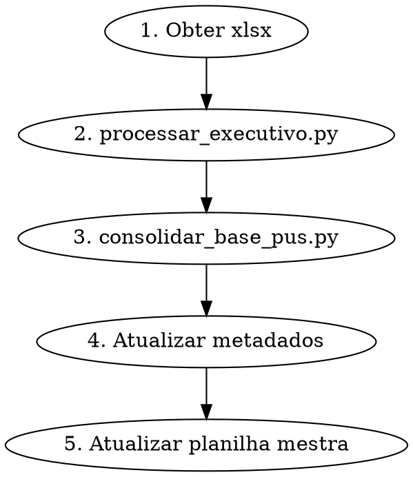

# Alimentar Base de Executivos

Processa orcamento executivo xlsx e alimenta a base Cartesian (PUs, indices, calibracao).

## Pipeline



### 1. Obter o arquivo xlsx

**Do Slack (equipe enviou na thread):**
```bash
python3.11 scripts/slack_file_downloader.py --bot cartesiano --baixar --thread [thread_ts]
```

**Do Drive (arquivo em _Entregas/):**
```bash
ls executivos/entregues/[Cliente]/[Obra]/*.xlsx
```

Mover/copiar para `executivos/entregues/[Cliente]/[Obra]/` se necessario.

### 2. Processar executivo

```bash
python3 scripts/processar_executivo.py --process "executivos/entregues/[Cliente]/[Obra]/[arquivo].xlsx"
```

Saidas:
- `base/pus-raw/[slug]-raw.json` — dados brutos
- `base/indices-executivo/[slug].json` — indices por disciplina

Verificar output:
- AC extraido corretamente?
- Macrogrupos identificados?
- N disciplinas e N itens?

### 3. Consolidar base

```bash
python3 scripts/consolidar_base_pus.py
```

Recalcula medianas de todos os PUs com o novo projeto incluido.

### 4. Atualizar metadados

Verificar `base/projetos-metadados.json`:
- Slug correto?
- Cidade e estado preenchidos?
- Regiao atribuida?

Se cidade estiver vazia, buscar em:
- `base/indices/[slug]-indices.md` (campo Localizacao)
- Planilha original (aba CAPA, campo Local/Cidade)

### 5. Atualizar planilha mestra

Regenerar `Base-Executivos-Processados.xlsx` com novo projeto incluido.

## Processamento batch (multiplos novos)

```bash
# Processar todos pendentes
python3 scripts/processar_executivo.py --batch

# Consolidar apos batch
python3 scripts/consolidar_base_pus.py
```

## Formatos suportados

O script detecta automaticamente:
- Multi-abas (disciplinas individuais)
- Sienge (aba Relatorio/EAP)
- Analitico hierarquico (X.X.X)
- ABC Insumos

## Regra de recalibracao

**Recalibrar medianas SEMPRE apos cada novo executivo.** Nao esperar acumular — cada executivo novo ja dispara recalibracao.

## Verificacao pos-processamento

Apos processar, confirmar:
- [ ] slug aparece em `base/indices-executivo/`
- [ ] slug aparece em `base/projetos-metadados.json`
- [ ] cidade preenchida
- [ ] `consolidar_base_pus.py` rodou sem erro
- [ ] Informar Leo: "Projeto [X] adicionado a base. Total: N projetos, N PUs."
