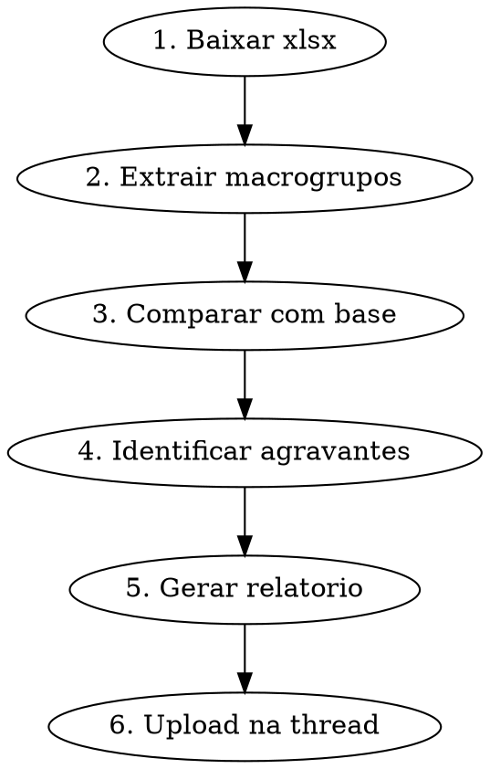

# Analisar Orcamento Executivo

Analisa um orcamento executivo comparando com a base de 75 projetos calibrados da Cartesian.

## Fluxo Obrigatorio



### 1. Baixar arquivo da thread

```bash
python3.11 scripts/slack_file_downloader.py --bot cartesiano --baixar --thread [thread_ts]
```

### 2. Extrair macrogrupos do xlsx

Ler planilha e identificar:
- AC (area construida)
- Total geral e R$/m2
- 18 macrogrupos com valor e R$/m2 de cada
- Segmento por porte (AC)

### 3. Comparar com base

```python
import json
with open('base/calibration-indices.json') as f:
    cal = json.load(f)

# Medianas por segmento
segs = cal['medianas_por_segmento']
# Faixas: pequeno_lt8k, medio_8k_15k, grande_15k_25k, muito_grande_gt25k
```

Para cada macrogrupo calcular:
- Delta % vs mediana do segmento
- Delta R$/m2 (absoluto)
- Impacto total em R$ (delta_rsm2 x AC)

### 4. Classificar agravantes e oportunidades

**Agravantes (acima da mediana):** ordenar por impacto em R$
- Top 5 com analise de possiveis causas
- Acoes recomendadas para cada

**Oportunidades (abaixo da mediana):**
- Itens eficientes (validar se nao esta subdimensionado)
- Itens faltantes (ex: impermeabilizacao nao aparece)

### 5. Gerar relatorio

Formato do relatorio:
```
RESUMO EXECUTIVO
- AC, R$/m2, Total, Segmento
- Delta geral vs mediana

TOP AGRAVANTES (por impacto R$)
- Cada um com: valor, base, delta%, impacto, causas, acoes

OPORTUNIDADES
- Itens abaixo da base
- Itens faltantes

ECONOMIA POTENCIAL: R$ X-Y milhoes

PROXIMOS PASSOS
1. ...
```

Salvar em:
```bash
output/[projeto]-analise-comparativa.md
output/[projeto]-analise-comparativa.xlsx  # opcional: planilha com detalhamento
```

### 6. Upload OBRIGATORIO na thread

```bash
python3.11 scripts/slack_uploader.py \
  --bot cartesiano \
  --file output/[projeto]-analise-comparativa.md \
  --thread [thread_ts] \
  --channel [channel_id] \
  --comment "Analise comparativa — [projeto]"
```

Se gerou xlsx tambem, fazer upload separado.

**SEM UPLOAD = ENTREGA NAO FEITA**

## Regras

- SEMPRE baixar arquivo da thread com slack_file_downloader.py
- SEMPRE comparar com mediana do SEGMENTO correto (por porte)
- SEMPRE ordenar agravantes por impacto em R$ (nao por %)
- SEMPRE incluir acoes concretas para cada agravante
- SEMPRE fazer upload do relatorio na thread
- Confidencialidade: NUNCA citar nomes de outros projetos — usar "base de N projetos do segmento"
