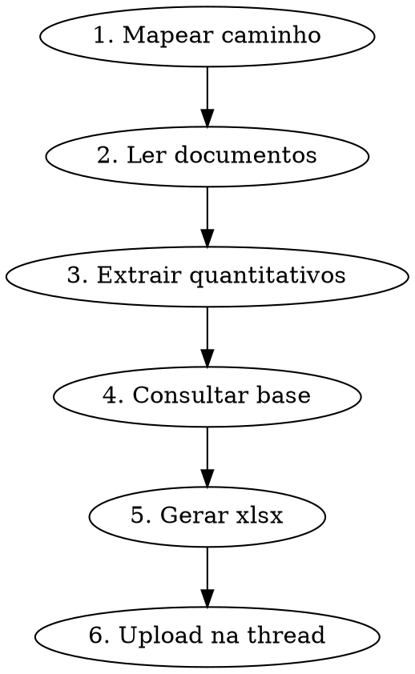

# Gerar Orcamento Parametrico

Gera orcamento parametrico de uma disciplina a partir de documentos do projeto (PDFs, DWGs, IFCs).

## Fluxo Obrigatorio



### 1. Mapear caminho do projeto

A equipe envia caminhos do Google Drive. CONVERTER para caminho local:
- `_Projetos_IA/[projeto]` → `projetos/[projeto]/`
- `2. Projetos em Andamento\_Projetos_IA\[projeto]` → `projetos/[projeto]/`
- Caminhos Windows com `\` → converter para `/`, ignorar letra do drive

```bash
ls projetos/[projeto]/   # NUNCA dizer que nao encontrou
```

### 2. Ler documentos do projeto

```bash
# Listar o que tem na pasta
ls projetos/[projeto]/[disciplina]/

# Para PDFs: extrair texto
# Para DWGs/DXFs: processar com ezdxf
# Para IFCs: processar com ifcopenshell
```

Extrair:
- Areas por tipo de revestimento/material
- Quantitativos por pavimento
- Especificacoes tecnicas (materiais, espessuras, sistemas)

### 3. Consultar base Cartesian

```python
# Base de 75 executivos com indices calibrados
import json
with open('base/calibration-indices.json') as f:
    indices = json.load(f)

# PUs de 1.504 itens
with open('base/base-pus-cartesian.json') as f:
    pus = json.load(f)

# Metadados dos projetos (cidade, regiao, segmento)
with open('base/projetos-metadados.json') as f:
    meta = json.load(f)
```

Buscar projetos similares por:
1. Segmento (porte): <8k, 8-15k, 15-25k, >25k m2
2. Regiao: mesma regiao primeiro, vizinha depois
3. Tipologia: residencial vertical, padrao (alto/medio)

### 4. Gerar planilha xlsx

Colunas obrigatorias:
- Item | Descricao | Un | Qtd | PU (R$) | Total (R$) | Fonte

Incluir:
- Detalhamento por tipo de material/sistema
- Separacao Torre vs Base se aplicavel
- Totais por secao e geral
- R$/m2 e comparativo com base

### 5. Salvar em output/

```bash
# Nome padrao: [projeto]-[disciplina]-orcamento.xlsx
# Dados JSON: [projeto]-[disciplina]-orcamento.json
```

### 6. Upload OBRIGATORIO na thread

```bash
python3.11 scripts/slack_uploader.py \
  --bot cartesiano \
  --file output/[arquivo].xlsx \
  --thread [thread_ts] \
  --channel [channel_id] \
  --comment "Orcamento parametrico [disciplina] — [projeto]"
```

- `thread_ts` = `topic_id` do metadata da mensagem
- `channel_id` = `chat_id` do metadata (extrair ID de `channel:CXXXXXXXXXX`)
- **SEM UPLOAD = ENTREGA NAO FEITA**

## Regras

- SEMPRE fazer upload do xlsx na thread (equipe nao tem acesso a output/)
- SEMPRE incluir fonte dos dados (base Cartesian, projeto, estimativa)
- SEMPRE comparar com base de projetos similares
- NUNCA inventar PUs — usar base-pus-cartesian.json ou estimar com justificativa
- Confidencialidade: em apresentacoes para cliente, NUNCA usar nomes reais de outros projetos — generalizar com tipologia + cidade
