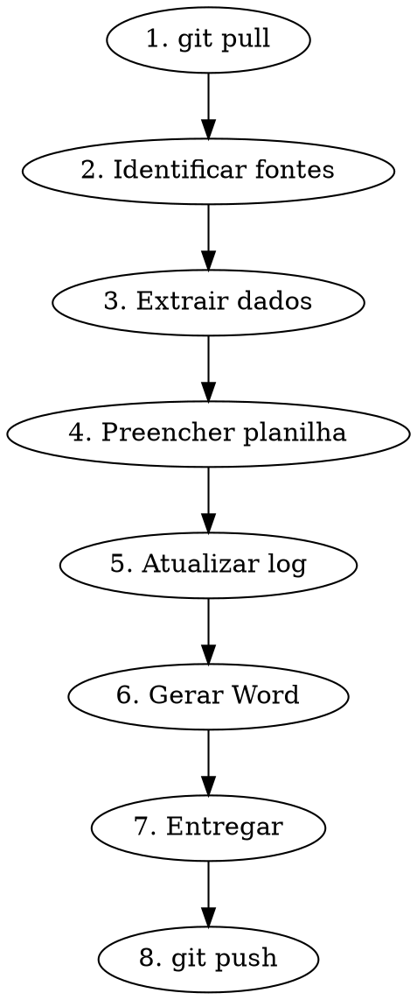

# Processar Disciplina (Modo Copiloto)

Preenche UMA disciplina/aba do orcamento executivo por vez no fluxo copiloto com Leo.

## Regra Fundamental

**NAO preencher planilha inteira de uma vez** — fica pesado e simplifica demais.
Leo passa 1 disciplina → Claude preenche → Leo cola no Excel master.

## Fluxo Obrigatorio



### 1. Git pull antes de comecar

```bash
cd ~/orcamentos && git pull
```

### 2. Identificar fontes disponiveis

Para a disciplina pedida, verificar:
- IFCs em `projetos/[projeto]/projetos/[disciplina]/IFC/`
- DWGs/DXFs em `projetos/[projeto]/projetos/[disciplina]/DWG/`
- Briefings existentes em `executivos/[projeto]/briefings/[disciplina]-*.md`
- Base PUs: `base/base-pus-cartesian.json`
- Indices: `base/calibration-indices.json`

### 3. Extrair dados

**De IFCs:** quantitativos (metragens, contagens, distribuicao por pavimento)
**De DWGs/DXFs:** componentes, conexoes, especificacoes tecnicas
**Da base:** PUs medianos, indices de consumo, splits MO/material

Separar por torre (T.A / T.B) quando aplicavel — usar coordenada X do IFC.

### 4. Preencher planilha

Gerar xlsx com:
- Formato: aba unica sequencial — Embasamento → Torre A → Torre B
- Colunas: Item | Descricao | Un | Qtd | PU (R$) | Total (R$) | Fonte
- Coluna Fonte: qual IFC/DWG/briefing gerou cada numero
- PUs em branco se nao tiver certeza (Leo preenche/valida)

Salvar em `executivos/[projeto]/entregas/`

### 5. Atualizar log-execucao.md

Adicionar NO FINAL da secao da disciplina correspondente:
- Fontes usadas
- Decisoes tomadas e premissas
- Quantitativos extraidos
- Dados pendentes
- Caminho da entrega

**NUNCA editar o que ja esta escrito** — Leo pode estar editando no Windows.

### 6. Gerar Memorial Word

```bash
pandoc executivos/[projeto]/log-execucao.md \
  -o executivos/[projeto]/entregas/Memorial-Execucao-[Projeto].docx \
  --from markdown --to docx
```

### 7. Entregar

3 entregas obrigatorias:
1. **Planilha xlsx** → ja esta em `entregas/` (Drive via symlink)
2. **log-execucao.md** atualizado → git
3. **Memorial Word** regenerado → `entregas/` (Drive)

Enviar xlsx pelo Telegram para Leo:
- Leo usa Telegram no Windows — SEMPRE enviar xlsx/docx pelo Telegram

### 8. Git commit + push

```bash
cd ~/orcamentos && git add executivos/[projeto]/log-execucao.md && \
git commit -m "docs: atualiza [disciplina] no memorial Electra" && git push
```

Tambem fazer push do ~/clawd se teve alteracao la.

## Checklist por Disciplina

| Disciplina | Fontes primarias | O que extrair |
|-----------|-----------------|---------------|
| Estrutura | IFC estrutural | Concreto m3, aco kg, forma m2, estacas |
| Alvenaria | DWG/DXF alvenaria | Area m2 por tipo bloco, vergas, encunhamento |
| Eletrico | IFC eletrico + DWG | Luminarias, eletrodutos, cabos, quadros |
| Hidrossanitario | IFC hidro + DWG | Tubulacoes por diametro, conexoes, equipamentos |
| Telecomunicacoes | IFC telecom + DWG | Pontos, eletrodutos, caixas, cabos |
| PCI | IFC PCI + DWG | Abrigos, extintores, tubulacao, bombas |
| Esquadrias | DWG arquitetura | Portas, janelas, vidros por tipologia |
| Climatizacao | DWG ar-cond | Equipamentos, tubulacoes, dutos |
| Loucas/Metais | IFC arquitetura | Bacias, cubas, metais por pavimento/torre |

## Regras

- SEMPRE fazer git pull antes e git push depois
- SEMPRE atualizar log-execucao.md (append-only)
- SEMPRE regenerar Memorial Word
- SEMPRE enviar xlsx pelo Telegram
- NUNCA preencher mais de 1 disciplina por vez sem confirmacao do Leo
- NUNCA editar partes existentes do log-execucao.md
